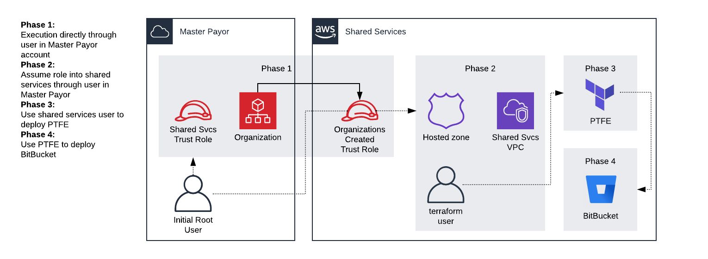

# TLZ Setup

## Prerequisites (manual non-programmatic)

* "core-bootstrap-master-payer" module has been successfully executed
* Private Terraform Enterprise (PTFE) license
* GitLab/BitBucket license
* Valid FQDN for shared services namespace
* Matching TLS cert keychain (must be exportable)

#### Activate appropriate variable declarations and assignments in variables.tf and terraform.auto.tfvars respectively ##### 

### Getting started

1. Update variables in terraform.tfvars file and make sure they are accurate for context of desired deployment.
   Specifically Ensure that "environment" and "shared_services_account_number" are set correctly. These will be different every deployment.
1. This will perform the following steps:
   Uses a provider that assumes role to the newly set up shared-services account.
   Creates a terraform_svc user in the shared-services account.
   Creates a VPC and tags subnets with public/private distinctions.
   Creates a hosted zone for Terraform Enterprise, GitLab, and other shared-services use.
1. The programmatic user created in the bootstrap-master-payer steps may now be deleted.

Executing this will provision Phase 2 in the below diagram.

From there the groundwork will have been set up to provision Terraform Enterprise and CodeRepository (i.e. GitLab).

